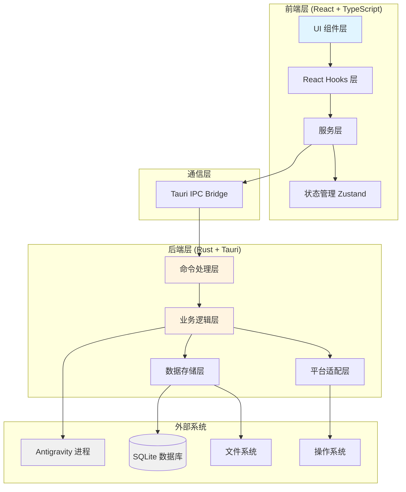
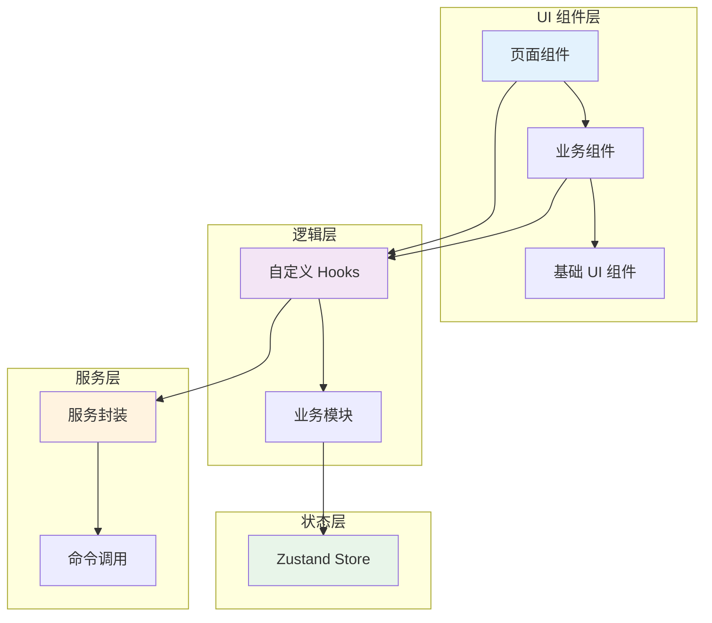
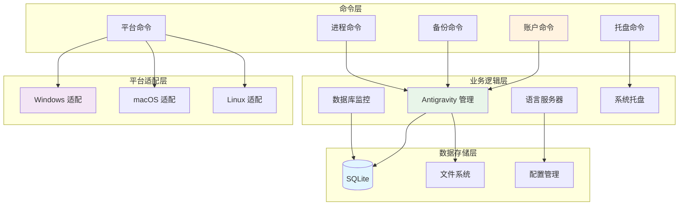
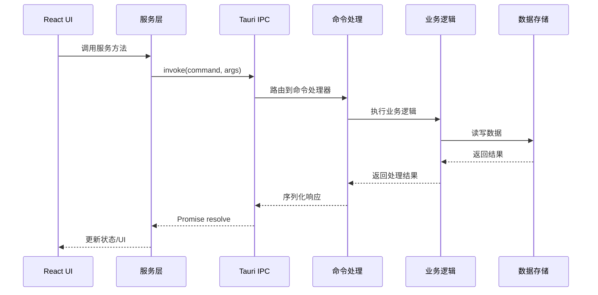
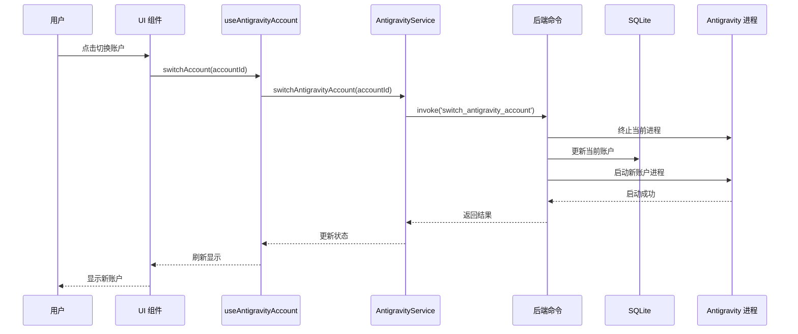
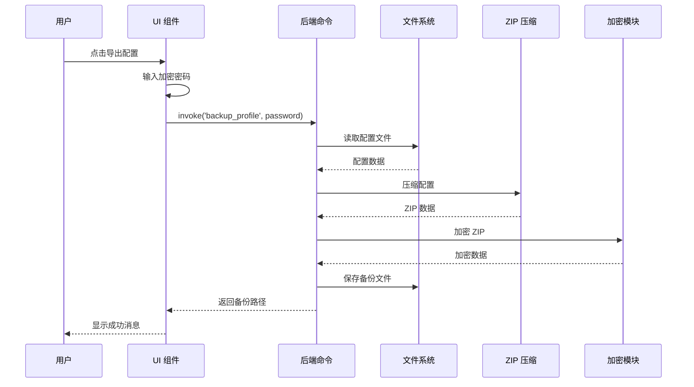
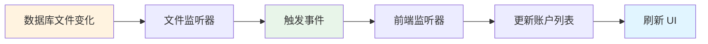
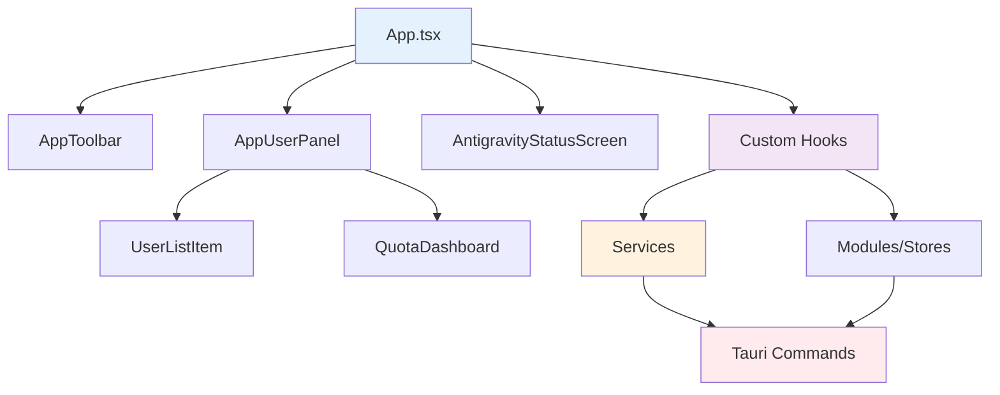
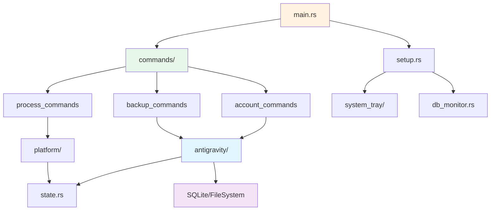
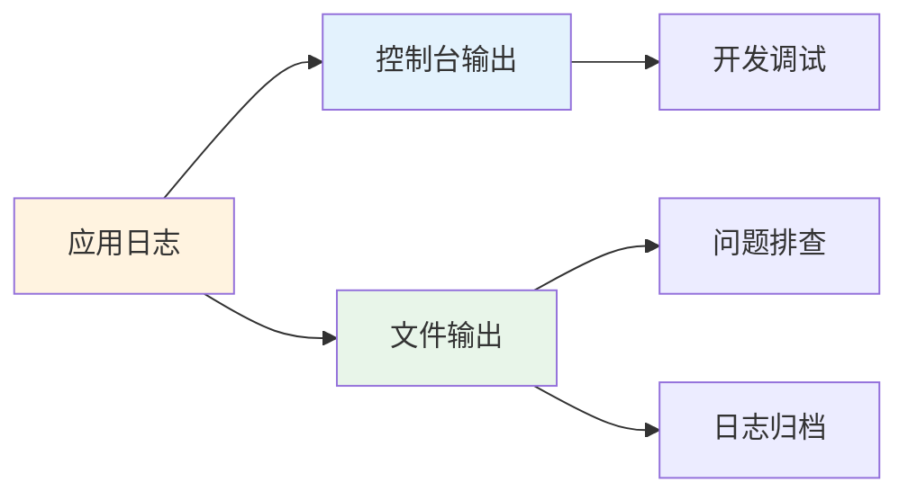

# 系统架构文档

## 概述

Antigravity Agent 是一个使用 Tauri + React + TypeScript 构建的跨平台桌面应用程序，用于管理 Antigravity 账户、配置备份和进程控制。本文档详细说明了系统的整体架构设计、技术选型理由以及各模块之间的交互关系。

### 核心特性

- **多账户管理**: 支持多个 Antigravity 账户的切换和管理
- **配置备份**: 支持账户配置的加密备份和恢复
- **进程控制**: 自动检测和管理 Antigravity 进程
- **数据库监控**: 实时监控 SQLite 数据库变化
- **系统托盘**: 支持后台运行和快速访问
- **跨平台支持**: Windows、macOS 和 Linux（计划中）

## 系统整体架构

### 架构图



### 技术栈

#### 前端技术栈
- **React 18**: 用户界面框架
- **TypeScript 5**: 类型安全的 JavaScript 超集
- **Vite 7**: 快速的前端构建工具
- **Tailwind CSS 3**: 实用优先的 CSS 框架
- **Radix UI**: 无样式的可访问 UI 组件库
- **Zustand**: 轻量级状态管理库
- **Lucide Icons**: 现代图标库

#### 后端技术栈
- **Rust**: 系统编程语言，提供内存安全和高性能
- **Tauri 2**: 使用 Web 技术构建桌面应用的框架
- **SQLite (rusqlite)**: 嵌入式数据库
- **Tokio**: 异步运行时
- **Tracing**: 结构化日志系统
- **Serde**: 序列化/反序列化框架

#### 开发工具
- **TypeScript Compiler**: 类型检查
- **Cargo**: Rust 包管理器和构建工具
- **npm**: Node.js 包管理器


## 前端架构（React + TypeScript）

### 架构分层



### 目录结构

```
src/
├── components/              # UI 组件
│   ├── base-ui/            # 基础 UI 组件（按钮、输入框等）
│   ├── business/           # 业务组件（用户面板、状态屏幕等）
│   └── ui/                 # 通用 UI 组件
├── hooks/                  # 自定义 React Hooks
│   ├── use-antigravity-process.ts
│   ├── use-current-antigravity-user.ts
│   ├── use-language-server-state.ts
│   └── useAntigravityIsRunning.ts
├── modules/                # 业务模块（状态管理）
│   ├── db-monitoring-store.ts
│   ├── use-antigravity-account.ts
│   └── use-import-export-accounts.ts
├── services/               # 服务层（封装后端调用）
│   ├── antigravity-service.ts
│   ├── antigravity-path-service.ts
│   ├── system-tray-service.ts
│   └── updateService.ts
├── commands/               # Tauri 命令类型定义
│   ├── AccountCommands.ts
│   ├── BackupCommands.ts
│   ├── ProcessCommands.ts
│   └── types/             # 命令类型定义
├── utils/                  # 工具函数
│   ├── logger.ts
│   └── username-masking.ts
├── types/                  # TypeScript 类型定义
├── App.tsx                 # 应用主组件
└── main.tsx               # 应用入口
```

### 核心组件说明

#### 1. UI 组件层

**基础 UI 组件 (base-ui/)**
- `BaseButton`: 按钮组件，支持多种样式变体
- `BaseDialog`: 对话框组件，基于 Radix UI
- `BaseInput`: 输入框组件
- `BaseSwitch`: 开关组件
- `BaseSpinner`: 加载动画组件

**业务组件 (business/)**
- `AntigravityStatusScreen`: Antigravity 状态显示屏幕
- `QuotaDashboard`: 配额仪表板
- `UserListItem`: 用户列表项
- `SettingsDialog`: 设置对话框

#### 2. Hooks 层

**进程管理 Hooks**
- `useAntigravityIsRunning`: 检测 Antigravity 进程运行状态
- `useAntigravityProcess`: 管理 Antigravity 进程（启动/停止）

**账户管理 Hooks**
- `useCurrentAntigravityUser`: 获取当前 Antigravity 用户信息
- `useSignInNewAntigravityAccount`: 处理新账户登录

**系统状态 Hooks**
- `useLanguageServerState`: 管理语言服务器状态
- `useUpdateChecker`: 检查应用更新

#### 3. 服务层

**AntigravityService**
- 封装账户切换、备份、恢复等操作
- 提供统一的错误处理

**AntigravityPathService**
- 检测 Antigravity 安装路径
- 管理数据库和可执行文件路径

**SystemTrayService**
- 管理系统托盘功能
- 处理托盘图标和菜单

#### 4. 状态管理

使用 Zustand 进行全局状态管理：

**db-monitoring-store**
- 管理数据库监控状态
- 处理数据库变化事件

**use-antigravity-account**
- 管理账户列表状态
- 处理账户切换逻辑


## 后端架构（Rust + Tauri）

### 架构分层



### 目录结构

```
src-tauri/src/
├── commands/                    # 命令处理层
│   ├── account_commands.rs     # 账户管理命令
│   ├── backup_commands.rs      # 备份恢复命令
│   ├── process_commands.rs     # 进程管理命令
│   ├── platform_commands.rs    # 平台相关命令
│   ├── tray_commands.rs        # 系统托盘命令
│   ├── logging_commands.rs     # 日志命令
│   └── mod.rs                  # 命令模块导出
├── antigravity/                # Antigravity 业务逻辑
│   ├── backup.rs              # 备份功能
│   ├── restore.rs             # 恢复功能
│   ├── cleanup.rs             # 清理功能
│   ├── starter.rs             # 启动器
│   ├── path_config.rs         # 路径配置
│   └── mod.rs
├── language_server/            # 语言服务器集成
│   ├── cache.rs               # 缓存管理
│   ├── commands.rs            # 语言服务器命令
│   ├── types.rs               # 类型定义
│   ├── utils.rs               # 工具函数
│   ├── windows.rs             # Windows 实现
│   ├── macos.rs               # macOS 实现
│   ├── linux.rs               # Linux 实现
│   └── mod.rs
├── platform/                   # 平台适配层
│   ├── antigravity.rs         # Antigravity 平台适配
│   ├── process.rs             # 进程管理
│   └── mod.rs
├── system_tray/                # 系统托盘
│   ├── manager.rs             # 托盘管理器
│   ├── menu.rs                # 托盘菜单
│   ├── events.rs              # 事件处理
│   └── mod.rs
├── window/                     # 窗口管理
│   ├── state_manager.rs       # 窗口状态管理
│   ├── event_handler.rs       # 窗口事件处理
│   └── mod.rs
├── utils/                      # 工具模块
│   ├── tracing_config.rs      # 日志配置
│   ├── log_sanitizer.rs       # 日志清理
│   └── mod.rs
├── state.rs                    # 全局状态管理
├── config_manager.rs           # 配置管理
├── app_settings.rs             # 应用设置
├── db_monitor.rs               # 数据库监控
├── path_utils.rs               # 路径工具
├── constants.rs                # 常量定义
├── setup.rs                    # 应用初始化
└── main.rs                     # 应用入口
```

### 核心模块说明

#### 1. 命令层 (commands/)

命令层负责处理来自前端的 IPC 调用，每个命令文件对应一类功能：

**account_commands.rs**
- `get_antigravity_accounts`: 获取所有账户
- `get_current_antigravity_info`: 获取当前账户信息
- `switch_antigravity_account`: 切换账户
- `backup_antigravity_current_account`: 备份当前账户
- `restore_antigravity_account`: 恢复账户

**backup_commands.rs**
- `backup_profile`: 备份配置文件
- `restore_profile`: 恢复配置文件
- `collect_backup_contents`: 收集备份内容
- `delete_backup`: 删除备份
- `encrypt_config_data`: 加密配置数据
- `decrypt_config_data`: 解密配置数据

**process_commands.rs**
- `is_antigravity_running`: 检查进程是否运行
- `start_antigravity`: 启动 Antigravity
- `kill_antigravity`: 终止 Antigravity 进程
- `list_antigravity_processes`: 列出所有进程
- `backup_and_restart_antigravity`: 备份并重启

**platform_commands.rs**
- `get_platform_info`: 获取平台信息
- `detect_antigravity_installation`: 检测安装路径
- `validate_antigravity_executable`: 验证可执行文件
- `find_antigravity_installations`: 查找所有安装

#### 2. 业务逻辑层

**antigravity/ 模块**

核心业务逻辑，处理 Antigravity 相关操作：

- **backup.rs**: 实现配置备份功能，支持加密
- **restore.rs**: 实现配置恢复功能，支持解密
- **cleanup.rs**: 清理临时文件和旧数据
- **starter.rs**: 启动 Antigravity 进程
- **path_config.rs**: 管理路径配置

**language_server/ 模块**

集成 Antigravity 语言服务器：

- **cache.rs**: 使用 Moka 实现内存缓存
- **commands.rs**: 语言服务器命令封装
- **windows.rs/macos.rs/linux.rs**: 平台特定实现

**db_monitor.rs**

实时监控 SQLite 数据库变化：
- 使用文件系统监听器检测数据库文件变化
- 触发前端更新事件

#### 3. 平台适配层 (platform/)

处理不同操作系统的差异：

**进程管理**
- Windows: 使用 Windows API (`windows` crate)
- macOS: 使用 `mach2` crate
- Linux: 使用 `libc` crate

**路径处理**
- Windows: `%APPDATA%\.antigravity-agent`
- macOS/Linux: `~/.config/.antigravity-agent`

#### 4. 数据存储层

**SQLite 数据库**
- 使用 `rusqlite` crate
- 存储账户信息和配置
- 支持事务和并发访问

**文件系统**
- 配置文件存储
- 备份文件管理
- 日志文件写入

**配置管理**
- 应用设置持久化
- 系统托盘状态
- 静默启动配置


## 数据流和通信机制

### IPC 通信流程



### 典型操作流程

#### 账户切换流程



#### 配置备份流程



### 事件驱动机制

#### 数据库监控事件



应用使用事件驱动模式处理数据库变化：

1. **后端监控**: 使用文件系统监听器监控 SQLite 数据库文件
2. **事件触发**: 检测到变化时触发 Tauri 事件
3. **前端监听**: React 组件监听事件并更新状态
4. **UI 更新**: 自动刷新账户列表和相关信息

#### 进程状态检查

应用定期检查 Antigravity 进程状态：

```typescript
// 前端定时检查
useEffect(() => {
  const interval = setInterval(() => {
    checkAntigravityStatus();
  }, 5000); // 每 5 秒检查一次
  
  return () => clearInterval(interval);
}, []);
```


## 模块依赖关系

### 前端依赖图



### 后端依赖图



### 关键依赖说明

#### 前端核心依赖

| 依赖包 | 版本 | 用途 |
|--------|------|------|
| react | ^18.3.1 | UI 框架 |
| @tauri-apps/api | ^2.9.0 | Tauri 前端 API |
| zustand | ^5.0.8 | 状态管理 |
| @radix-ui/* | ^1.0+ | UI 组件库 |
| tailwindcss | ^3.4.18 | CSS 框架 |
| lucide-react | ^0.344.0 | 图标库 |

#### 后端核心依赖

| 依赖包 | 版本 | 用途 |
|--------|------|------|
| tauri | 2.9 | 桌面应用框架 |
| tokio | 1.48 | 异步运行时 |
| rusqlite | 0.32 | SQLite 数据库 |
| serde | 1.0 | 序列化/反序列化 |
| tracing | 0.1 | 日志系统 |
| moka | 0.12 | 内存缓存 |

## 技术栈选型理由

### 为什么选择 Tauri？

#### Tauri vs Electron

| 特性 | Tauri | Electron |
|------|-------|----------|
| 包体积 | ~3-5 MB | ~50-100 MB |
| 内存占用 | ~50-100 MB | ~200-500 MB |
| 启动速度 | 快 | 较慢 |
| 安全性 | 高（Rust 内存安全） | 中等 |
| 跨平台 | 支持 | 支持 |
| 生态系统 | 较新 | 成熟 |

**选择 Tauri 的原因**：

1. **更小的包体积**: Tauri 使用系统 WebView，不需要打包 Chromium，应用体积显著减小
2. **更低的资源占用**: 内存和 CPU 占用更少，适合长期后台运行
3. **更好的安全性**: Rust 的内存安全特性减少了安全漏洞
4. **更快的启动速度**: 不需要启动完整的浏览器引擎
5. **现代化的开发体验**: 与 Rust 生态系统无缝集成

### 为什么选择 React？

1. **成熟的生态系统**: 丰富的组件库和工具链
2. **声明式 UI**: 简化复杂 UI 的开发
3. **Hooks API**: 提供优雅的状态管理和副作用处理
4. **TypeScript 支持**: 完善的类型定义
5. **开发者熟悉度**: 广泛使用，易于招募和培训

### 为什么选择 Zustand？

相比 Redux 和 MobX：

1. **更简单的 API**: 无需 actions、reducers 等样板代码
2. **更小的包体积**: ~1KB（gzipped）
3. **更好的 TypeScript 支持**: 类型推断更准确
4. **无需 Context Provider**: 直接使用 hooks
5. **性能优秀**: 基于订阅的更新机制

### 为什么选择 Rust？

1. **内存安全**: 编译时保证内存安全，无需 GC
2. **高性能**: 接近 C/C++ 的性能
3. **并发安全**: 所有权系统防止数据竞争
4. **跨平台**: 统一的代码库支持多平台
5. **现代化工具链**: Cargo 提供优秀的包管理和构建体验


## 跨平台实现策略

### 平台差异处理

应用通过条件编译和运行时检测处理平台差异：

#### 编译时平台适配

```rust
// 平台特定依赖
#[cfg(target_os = "windows")]
use windows::Win32::System::Threading::*;

#[cfg(target_os = "macos")]
use mach2::*;

#[cfg(unix)]
use libc::*;

// 平台特定实现
#[cfg(target_os = "windows")]
fn get_process_memory(pid: u32) -> Result<u64> {
    // Windows 实现
}

#[cfg(target_os = "macos")]
fn get_process_memory(pid: u32) -> Result<u64> {
    // macOS 实现
}
```

#### 运行时平台检测

```typescript
// 前端平台检测
import { platform } from '@tauri-apps/plugin-os';

const currentPlatform = await platform();
if (currentPlatform === 'windows') {
  // Windows 特定逻辑
} else if (currentPlatform === 'macos') {
  // macOS 特定逻辑
}
```

### 平台特定功能

#### Windows

- **进程管理**: 使用 Windows API 获取进程信息
- **路径**: `%APPDATA%\.antigravity-agent`
- **系统托盘**: 使用 Windows 原生托盘 API

#### macOS

- **进程管理**: 使用 `mach2` 获取进程信息
- **路径**: `~/.config/.antigravity-agent`
- **系统托盘**: 使用 macOS 原生菜单栏 API
- **权限**: 可能需要辅助功能权限

#### Linux（计划中）

- **进程管理**: 使用 `/proc` 文件系统
- **路径**: `~/.config/.antigravity-agent`
- **系统托盘**: 使用 DBus 或 AppIndicator

### 路径管理策略

```rust
// 统一的路径获取接口
pub fn get_config_dir() -> PathBuf {
    if cfg!(windows) {
        std::env::var_os("APPDATA")
            .map(|appdata| PathBuf::from(appdata).join(".antigravity-agent"))
            .unwrap_or_else(|| PathBuf::from(".antigravity-agent"))
    } else {
        dirs::config_dir()
            .unwrap_or_else(|| PathBuf::from("."))
            .join(".antigravity-agent")
    }
}
```

## 安全性设计

### 数据加密

**配置备份加密**
- 使用 AES-256-GCM 加密算法
- 用户提供的密码通过 PBKDF2 派生密钥
- 每次备份使用随机 IV（初始化向量）

```rust
// 加密流程
pub fn encrypt_backup(data: &[u8], password: &str) -> Result<Vec<u8>> {
    // 1. 生成随机盐
    let salt = generate_random_salt();
    
    // 2. 使用 PBKDF2 派生密钥
    let key = derive_key(password, &salt);
    
    // 3. 使用 AES-256-GCM 加密
    let encrypted = aes_encrypt(data, &key)?;
    
    // 4. 组合盐和加密数据
    Ok(combine(salt, encrypted))
}
```

### IPC 安全

**命令白名单**
- 只有明确注册的命令可以被前端调用
- 使用 Tauri 的 `invoke_handler` 机制

**参数验证**
- 所有命令参数都经过类型检查
- 使用 Serde 进行反序列化验证

### 文件系统安全

**路径验证**
- 所有文件操作都验证路径合法性
- 防止路径遍历攻击

**权限控制**
- 配置文件使用受限权限（仅当前用户可读写）
- 备份文件加密存储

### 进程隔离

- 前端运行在 WebView 沙箱中
- 后端 Rust 代码具有完整系统权限
- 通过 IPC 严格控制权限边界

## 性能优化

### 前端性能优化

#### 1. 代码分割

```typescript
// 使用 React.lazy 进行代码分割
const SettingsDialog = React.lazy(() => 
  import('./components/business/SettingsDialog')
);
```

#### 2. 状态更新优化

```typescript
// 使用 Zustand 的选择器避免不必要的重渲染
const username = useAntigravityAccount(state => state.currentUser?.username);
```

#### 3. 虚拟化长列表

对于大量账户的场景，使用虚拟滚动：

```typescript
// 只渲染可见区域的项目
<VirtualList
  items={accounts}
  itemHeight={60}
  renderItem={(account) => <UserListItem account={account} />}
/>
```

### 后端性能优化

#### 1. 异步处理

```rust
// 使用 Tokio 异步运行时
#[tauri::command]
async fn backup_profile(password: String) -> Result<String> {
    tokio::spawn(async move {
        // 异步执行备份操作
    }).await?
}
```

#### 2. 缓存机制

```rust
// 使用 Moka 缓存语言服务器响应
use moka::future::Cache;

lazy_static! {
    static ref USER_CACHE: Cache<String, UserInfo> = 
        Cache::builder()
            .max_capacity(100)
            .time_to_live(Duration::from_secs(300))
            .build();
}
```

#### 3. 数据库连接池

```rust
// 复用数据库连接
pub struct DbPool {
    connections: Vec<Connection>,
}

impl DbPool {
    pub fn get_connection(&mut self) -> &mut Connection {
        // 返回可用连接
    }
}
```

### 启动优化

1. **延迟初始化**: 非关键功能延迟加载
2. **并行检测**: 同时检测多个路径
3. **缓存配置**: 缓存上次检测结果

```rust
// 并行检测多个可能的安装路径
let handles: Vec<_> = possible_paths
    .into_iter()
    .map(|path| tokio::spawn(async move {
        check_path(path).await
    }))
    .collect();

let results = futures::future::join_all(handles).await;
```

## 日志系统

### 双层日志架构



### 日志配置

```rust
// 初始化双层日志系统
fn init_tracing() -> WorkerGuard {
    let log_dir = get_log_directory();
    let file_appender = rolling::daily(&log_dir, "antigravity-agent");
    let (non_blocking, guard) = non_blocking(file_appender);
    
    tracing_subscriber::registry()
        .with(
            // 控制台层：彩色、紧凑格式
            tracing_subscriber::fmt::layer()
                .with_writer(std::io::stdout)
                .compact()
                .with_ansi(true)
        )
        .with(
            // 文件层：JSON 格式、结构化
            tracing_subscriber::fmt::layer()
                .with_writer(non_blocking)
                .json()
                .with_ansi(false)
        )
        .init();
    
    guard
}
```

### 日志级别

- **ERROR**: 错误信息，需要立即关注
- **WARN**: 警告信息，可能导致问题
- **INFO**: 一般信息，记录关键操作
- **DEBUG**: 调试信息，详细的执行流程
- **TRACE**: 追踪信息，最详细的日志

### 日志示例

```rust
tracing::info!(
    target: "app::account",
    account_id = %account_id,
    "切换账户成功"
);

tracing::error!(
    target: "app::backup",
    error = %e,
    "备份失败"
);
```

## 相关文档

- [开发环境搭建指南](./development-guide.md)
- [贡献指南](./contributing.md)
- [代码规范](./code-style.md)
- [API 参考文档](../user-guide/api-reference.md)
- [配置说明](../user-guide/configuration.md)

## 参考资源

### 官方文档

- [Tauri 官方文档](https://tauri.app/)
- [React 官方文档](https://react.dev/)
- [Rust 官方文档](https://www.rust-lang.org/)
- [TypeScript 官方文档](https://www.typescriptlang.org/)

### 相关技术

- [Zustand 文档](https://github.com/pmndrs/zustand)
- [Radix UI 文档](https://www.radix-ui.com/)
- [Tailwind CSS 文档](https://tailwindcss.com/)
- [Tokio 文档](https://tokio.rs/)
- [Tracing 文档](https://docs.rs/tracing/)

---

**最后更新**: 2025-12-04  
**文档版本**: 1.0.3
