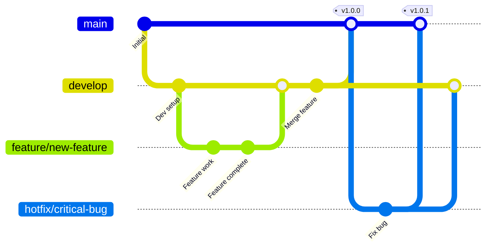
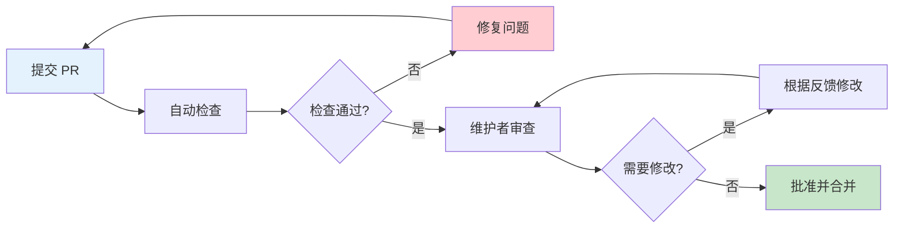

# 贡献指南

感谢您对 Antigravity Agent 项目的关注！我们欢迎所有形式的贡献，包括但不限于：

- 🐛 报告 Bug
- 💡 提出新功能建议
- 📝 改进文档
- 🔧 提交代码修复
- ✨ 开发新功能

本文档将指导您如何参与项目贡献。

## 目录

- [行为准则](#行为准则)
- [贡献方式](#贡献方式)
- [开发流程](#开发流程)
- [分支管理策略](#分支管理策略)
- [提交信息规范](#提交信息规范)
- [Pull Request 流程](#pull-request-流程)
- [代码审查](#代码审查)
- [问题反馈](#问题反馈)

## 行为准则

### 我们的承诺

为了营造一个开放和友好的环境，我们作为贡献者和维护者承诺：

- 尊重所有贡献者，无论其经验水平、性别、性别认同、性取向、残疾、外貌、体型、种族、民族、年龄、宗教或国籍
- 使用友好和包容的语言
- 尊重不同的观点和经验
- 优雅地接受建设性批评
- 关注对社区最有利的事情
- 对其他社区成员表示同理心

### 不可接受的行为

- 使用性化的语言或图像
- 人身攻击或侮辱性评论
- 公开或私下骚扰
- 未经许可发布他人的私人信息
- 其他在专业环境中被认为不适当的行为

### 执行

违反行为准则的行为可能导致暂时或永久禁止参与项目。

## 贡献方式

### 报告 Bug

发现 Bug？请通过以下步骤报告：

1. **检查是否已存在**: 在 [Issues](https://github.com/MonchiLin/antigravity-agent/issues) 中搜索，确认问题尚未被报告
2. **创建新 Issue**: 使用 Bug 报告模板
3. **提供详细信息**:
   - 清晰的标题和描述
   - 重现步骤
   - 预期行为和实际行为
   - 截图或错误日志
   - 环境信息（操作系统、版本等）

**Bug 报告模板**:

```markdown
## Bug 描述
简要描述遇到的问题

## 重现步骤
1. 打开应用
2. 点击 '...'
3. 滚动到 '...'
4. 看到错误

## 预期行为
描述您期望发生什么

## 实际行为
描述实际发生了什么

## 截图
如果适用，添加截图帮助解释问题

## 环境信息
- 操作系统: [例如 Windows 11]
- 应用版本: [例如 1.0.3]
- Antigravity 版本: [例如 2.0.0]

## 附加信息
添加任何其他相关信息
```

### 提出功能建议

有新想法？我们很乐意听取！

1. **检查是否已存在**: 搜索现有的功能请求
2. **创建 Feature Request**: 使用功能请求模板
3. **详细说明**:
   - 功能的用途和价值
   - 预期的使用场景
   - 可能的实现方案
   - 相关的截图或原型

### 改进文档

文档改进同样重要：

- 修正拼写或语法错误
- 添加缺失的说明
- 改进示例代码
- 翻译文档到其他语言

文档位于 `docs/` 目录，使用 Markdown 格式编写。


## 开发流程

### 1. Fork 项目

1. 访问 [Antigravity Agent GitHub 仓库](https://github.com/MonchiLin/antigravity-agent)
2. 点击右上角的 "Fork" 按钮
3. 将项目 Fork 到您的 GitHub 账户

### 2. 克隆仓库

```bash
# 克隆您 Fork 的仓库
git clone https://github.com/YOUR_USERNAME/antigravity-agent.git

# 进入项目目录
cd antigravity-agent

# 添加上游仓库
git remote add upstream https://github.com/MonchiLin/antigravity-agent.git
```

### 3. 创建分支

```bash
# 确保在最新的 main 分支
git checkout main
git pull upstream main

# 创建新分支
git checkout -b feature/your-feature-name
# 或
git checkout -b fix/your-bug-fix
```

### 4. 开发和测试

```bash
# 安装依赖
npm install

# 启动开发服务器
npm run tauri:dev

# 进行开发...

# 运行测试（如果有）
npm run test
cd src-tauri && cargo test
```

### 5. 提交更改

```bash
# 查看更改
git status

# 添加文件
git add .

# 提交（遵循提交信息规范）
git commit -m "feat: add new feature"

# 推送到您的 Fork
git push origin feature/your-feature-name
```

### 6. 创建 Pull Request

1. 访问您 Fork 的仓库页面
2. 点击 "Compare & pull request" 按钮
3. 填写 PR 描述（使用模板）
4. 提交 Pull Request

### 7. 代码审查和合并

- 维护者会审查您的代码
- 根据反馈进行修改
- 审查通过后，代码将被合并

## 分支管理策略

### 分支类型

我们使用 Git Flow 分支模型：

#### main 分支
- **用途**: 生产环境代码
- **保护**: 受保护，不能直接推送
- **来源**: 从 `develop` 或 `hotfix/*` 合并

#### develop 分支
- **用途**: 开发环境代码
- **保护**: 受保护，不能直接推送
- **来源**: 从 `feature/*` 合并

#### feature/* 分支
- **用途**: 新功能开发
- **命名**: `feature/功能名称`
- **示例**: `feature/add-backup-encryption`
- **基于**: `develop` 分支
- **合并到**: `develop` 分支

#### fix/* 分支
- **用途**: Bug 修复
- **命名**: `fix/问题描述`
- **示例**: `fix/account-switch-error`
- **基于**: `develop` 分支
- **合并到**: `develop` 分支

#### hotfix/* 分支
- **用途**: 紧急修复生产问题
- **命名**: `hotfix/问题描述`
- **示例**: `hotfix/critical-crash`
- **基于**: `main` 分支
- **合并到**: `main` 和 `develop` 分支

#### docs/* 分支
- **用途**: 文档更新
- **命名**: `docs/文档主题`
- **示例**: `docs/update-installation-guide`
- **基于**: `develop` 分支
- **合并到**: `develop` 分支

### 分支命名规范

```
类型/简短描述

类型:
- feature: 新功能
- fix: Bug 修复
- hotfix: 紧急修复
- docs: 文档更新
- refactor: 代码重构
- test: 测试相关
- chore: 构建/工具相关

示例:
feature/multi-language-support
fix/memory-leak-in-monitor
docs/add-api-reference
refactor/simplify-backup-logic
```

### 分支生命周期




## 提交信息规范

我们遵循 [Conventional Commits](https://www.conventionalcommits.org/) 规范。

### 提交信息格式

```
<类型>(<范围>): <简短描述>

<详细描述>

<页脚>
```

### 类型 (Type)

| 类型 | 说明 | 示例 |
|------|------|------|
| `feat` | 新功能 | `feat: add backup encryption` |
| `fix` | Bug 修复 | `fix: resolve account switch error` |
| `docs` | 文档更新 | `docs: update installation guide` |
| `style` | 代码格式（不影响功能） | `style: format code with prettier` |
| `refactor` | 代码重构 | `refactor: simplify backup logic` |
| `perf` | 性能优化 | `perf: optimize database queries` |
| `test` | 测试相关 | `test: add unit tests for backup` |
| `chore` | 构建/工具相关 | `chore: update dependencies` |
| `ci` | CI/CD 相关 | `ci: add GitHub Actions workflow` |
| `revert` | 回滚提交 | `revert: revert commit abc123` |

### 范围 (Scope)

范围是可选的，用于指定提交影响的模块：

- `account`: 账户管理
- `backup`: 备份功能
- `process`: 进程管理
- `ui`: 用户界面
- `db`: 数据库
- `tray`: 系统托盘
- `docs`: 文档

### 示例

#### 简单提交

```bash
git commit -m "feat: add password encryption for backups"
git commit -m "fix: resolve memory leak in database monitor"
git commit -m "docs: add API reference documentation"
```

#### 带范围的提交

```bash
git commit -m "feat(backup): add AES-256 encryption"
git commit -m "fix(account): resolve switch account error"
git commit -m "perf(db): optimize query performance"
```

#### 带详细描述的提交

```bash
git commit -m "feat(backup): add backup encryption

- Implement AES-256-GCM encryption
- Add password derivation using PBKDF2
- Update backup file format to include encryption metadata

Closes #123"
```

#### Breaking Changes

如果提交包含破坏性变更，需要在页脚添加 `BREAKING CHANGE:`:

```bash
git commit -m "feat(api): change backup API signature

BREAKING CHANGE: backup() now requires a password parameter"
```

### 提交信息检查

我们建议使用 commitlint 检查提交信息：

```bash
# 安装 commitlint
npm install -D @commitlint/cli @commitlint/config-conventional

# 配置 commitlint
echo "module.exports = {extends: ['@commitlint/config-conventional']}" > commitlint.config.js

# 使用 husky 自动检查
npm install -D husky
npx husky install
npx husky add .husky/commit-msg 'npx --no -- commitlint --edit "$1"'
```

## Pull Request 流程

### PR 模板

创建 PR 时，请使用以下模板：

```markdown
## 变更类型
- [ ] Bug 修复
- [ ] 新功能
- [ ] 代码重构
- [ ] 文档更新
- [ ] 其他（请说明）

## 变更描述
简要描述此 PR 的目的和内容

## 相关 Issue
Closes #(issue 编号)

## 变更内容
- 添加了 XXX 功能
- 修复了 XXX 问题
- 重构了 XXX 模块

## 测试
- [ ] 已在本地测试
- [ ] 已添加单元测试
- [ ] 已添加集成测试
- [ ] 已更新文档

## 截图（如适用）
添加截图展示变更效果

## 检查清单
- [ ] 代码遵循项目代码规范
- [ ] 已运行 `npm run type-check` 且无错误
- [ ] 已运行 `cargo clippy` 且无警告
- [ ] 已更新相关文档
- [ ] 提交信息遵循规范
- [ ] 已测试所有变更
```

### PR 提交步骤

1. **确保代码质量**

```bash
# TypeScript 类型检查
npm run type-check

# Rust 代码检查
cd src-tauri
cargo clippy
cargo fmt --check

# 运行测试
cargo test
cd ..
npm run test
```

2. **更新文档**

如果您的更改影响了用户使用或开发流程，请更新相关文档。

3. **创建 Pull Request**

- 使用清晰的标题
- 填写完整的 PR 描述
- 关联相关 Issue
- 添加适当的标签

4. **等待审查**

维护者会在 1-3 个工作日内审查您的 PR。

### PR 审查标准

您的 PR 需要满足以下条件才能被合并：

- ✅ 通过所有 CI 检查
- ✅ 代码符合项目规范
- ✅ 至少一位维护者批准
- ✅ 没有未解决的评论
- ✅ 文档已更新（如需要）
- ✅ 测试已添加（如需要）

### PR 大小建议

- **小型 PR** (< 200 行): 最理想，易于审查
- **中型 PR** (200-500 行): 可接受，需要详细说明
- **大型 PR** (> 500 行): 建议拆分成多个小 PR

如果必须提交大型 PR，请：
- 提供详细的变更说明
- 将相关变更分组
- 考虑分阶段提交


## 代码审查

### 审查流程



### 审查重点

审查者会关注以下方面：

#### 1. 代码质量

- **可读性**: 代码是否清晰易懂
- **简洁性**: 是否有不必要的复杂性
- **一致性**: 是否符合项目代码风格
- **命名**: 变量和函数命名是否恰当

#### 2. 功能正确性

- **逻辑**: 实现逻辑是否正确
- **边界情况**: 是否处理了边界情况
- **错误处理**: 错误是否被正确处理
- **性能**: 是否有性能问题

#### 3. 测试覆盖

- **单元测试**: 是否有足够的单元测试
- **集成测试**: 关键流程是否有集成测试
- **测试质量**: 测试是否有效

#### 4. 文档完整性

- **代码注释**: 复杂逻辑是否有注释
- **API 文档**: 公开 API 是否有文档
- **用户文档**: 用户可见的变更是否更新了文档

### 如何响应审查意见

#### 积极响应

```markdown
感谢您的审查！我已经：
- 修复了您指出的命名问题
- 添加了边界情况的测试
- 更新了相关文档

请再次审查。
```

#### 讨论不同意见

```markdown
关于这个实现方案，我有不同的看法：
- 当前方案的优势是...
- 您建议的方案可能会导致...
- 我们可以考虑第三种方案...

您觉得如何？
```

#### 请求澄清

```markdown
感谢您的反馈！关于这个评论，我不太确定您的意思：
- 您是指...吗？
- 还是您建议...？

能否详细说明一下？
```

### 审查者指南

如果您是审查者，请：

#### 提供建设性反馈

❌ **不好的反馈**:
```
这段代码写得很糟糕
```

✅ **好的反馈**:
```
这个函数有点复杂，建议拆分成几个小函数：
- extractUserData()
- validateUserData()
- saveUserData()

这样会更容易测试和维护。
```

#### 区分必须修改和建议

使用标签明确优先级：

- `[必须]`: 必须修改才能合并
- `[建议]`: 建议修改，但不强制
- `[问题]`: 需要讨论的问题
- `[赞]`: 表扬好的实现

示例：
```
[必须] 这里需要添加错误处理，否则可能导致崩溃

[建议] 可以考虑使用 Map 代替数组，性能会更好

[赞] 这个抽象设计得很好！
```

#### 及时响应

- 尽量在 1-3 个工作日内完成审查
- 如果需要更多时间，请告知贡献者
- 对于简单的 PR，可以快速批准

## 问题反馈

### 如何提出好的问题

#### 1. 搜索现有问题

在创建新 Issue 前，请搜索是否已有类似问题。

#### 2. 使用清晰的标题

❌ **不好的标题**:
```
应用崩溃了
```

✅ **好的标题**:
```
切换账户时应用崩溃 (Windows 11, v1.0.3)
```

#### 3. 提供完整信息

包括：
- 问题描述
- 重现步骤
- 预期行为
- 实际行为
- 环境信息
- 错误日志
- 截图（如适用）

#### 4. 使用代码块

使用 Markdown 代码块格式化代码和日志：

````markdown
```typescript
// 您的代码
const result = await switchAccount(accountId);
```

```
// 错误日志
Error: Account not found
  at switchAccount (account.ts:42)
```
````

### Issue 标签

我们使用以下标签分类 Issue：

| 标签 | 说明 |
|------|------|
| `bug` | Bug 报告 |
| `enhancement` | 功能增强 |
| `documentation` | 文档相关 |
| `good first issue` | 适合新手的问题 |
| `help wanted` | 需要帮助 |
| `question` | 问题咨询 |
| `wontfix` | 不会修复 |
| `duplicate` | 重复的问题 |
| `invalid` | 无效的问题 |

### 参与讨论

- 在 Issue 中分享您的想法和建议
- 帮助其他用户解决问题
- 参与功能设计讨论
- 提供测试反馈

## 开发资源

### 学习资源

#### Tauri
- [Tauri 官方文档](https://tauri.app/)
- [Tauri 示例](https://github.com/tauri-apps/tauri/tree/dev/examples)

#### Rust
- [Rust Book](https://doc.rust-lang.org/book/)
- [Rust by Example](https://doc.rust-lang.org/rust-by-example/)
- [Rustlings](https://github.com/rust-lang/rustlings)

#### React
- [React 官方文档](https://react.dev/)
- [React TypeScript Cheatsheet](https://react-typescript-cheatsheet.netlify.app/)

#### TypeScript
- [TypeScript 官方文档](https://www.typescriptlang.org/)
- [TypeScript Deep Dive](https://basarat.gitbook.io/typescript/)

### 社区

- **GitHub Discussions**: 讨论功能和想法
- **Issues**: 报告 Bug 和请求功能
- **Pull Requests**: 贡献代码

### 获取帮助

如果您在贡献过程中遇到问题：

1. 查看相关文档
2. 搜索现有 Issue
3. 在 GitHub Discussions 提问
4. 创建新 Issue 寻求帮助

## 致谢

感谢所有为 Antigravity Agent 做出贡献的开发者！

您的贡献将被记录在：
- [Contributors](https://github.com/MonchiLin/antigravity-agent/graphs/contributors) 页面
- 项目 Release Notes 中

## 相关文档

### 开发文档
- [开发指南](./development-guide.md) - 开发环境搭建和工作流程
- [代码规范](./code-style.md) - 代码风格和最佳实践
- [系统架构](./architecture.md) - 系统整体架构设计

### 入门文档
- [项目概览](../getting-started/README.md) - 了解项目的基本信息
- [快速开始](../getting-started/quickstart.md) - 5 分钟快速上手教程

### 使用文档
- [使用手册](../user-guide/user-guide.md) - 完整的功能说明和操作指南

### 进阶文档
- [设计原理](../advanced/design-principles.md) - 核心设计思路和技术选型
- [问题排查](../advanced/troubleshooting.md) - 常见问题诊断和解决
- [FAQ](../advanced/faq.md) - 常见问题解答

### 返回
- [文档首页](../../README.md) - 返回文档导航页

---

**最后更新**: 2025-12-04
**文档版本**: 1.0.3

再次感谢您的贡献！🎉
